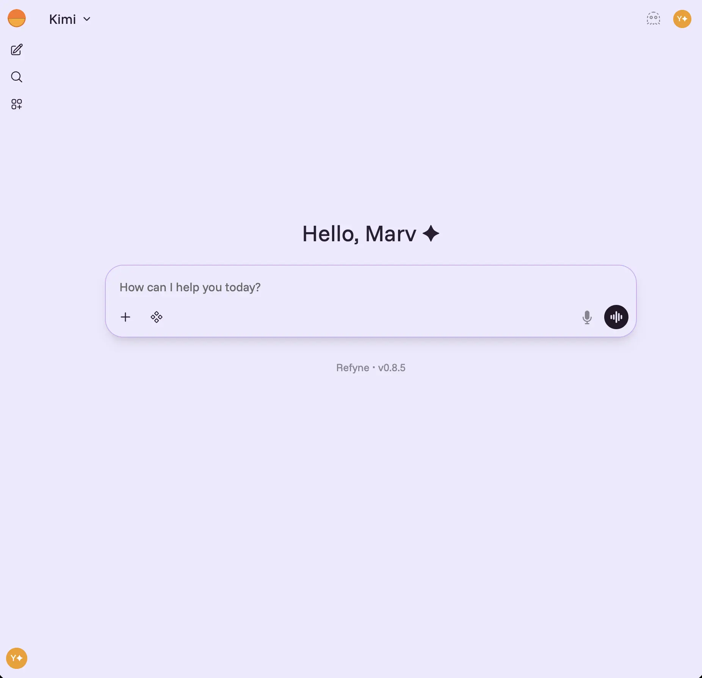
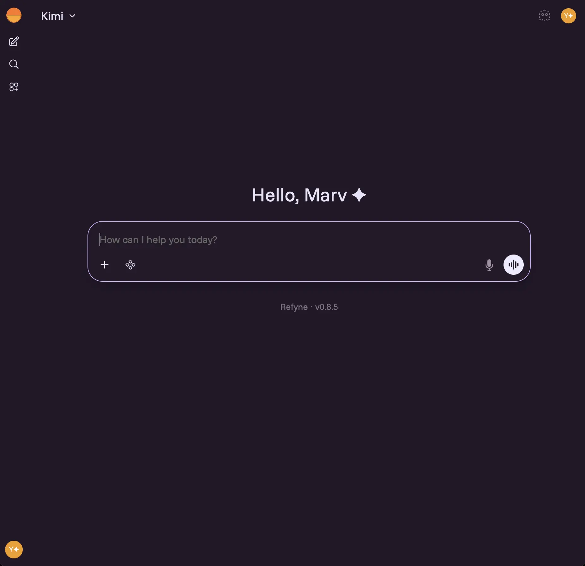

# Refyne ✨

Open-webui with a cleaner design and quality of workflow improvements.

  
  &nbsp;&nbsp;
  

## What's Changed

### ✦ UX

- Custom theme for dark and light mode
- Cleaner UI with a revamped and hidden navbar
- Separate settings for 'enter for newline' on mobile and up
- Many more quality of life and UX changes

### ⚙ Tech Stack

- Uses bun and biome instead of npm and eslint+prettier
- Migration to tailwind v4 in progress
- Unified themes
- 🚀 Much more coming soon

> Always tracks the latest open-webui releases

---

*Maintained by [stickyburn](https://www.linkedin.com/in/yashaank/)*
